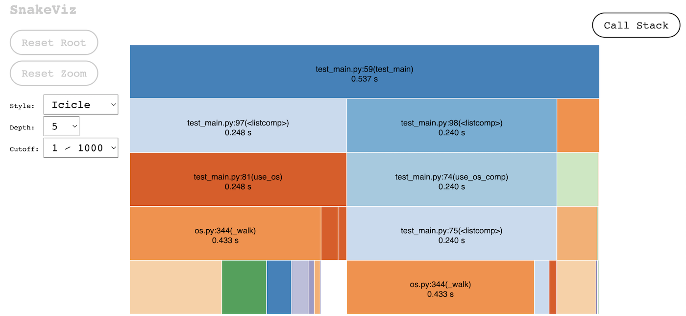

# Glob v.s. OS Walk


This article is a follow-up to &ldquo;Glob generators in Python&rdquo;, we are going to compare the `os.walk`<sup><a id="fnr.1" class="footref" href="#fn.1" role="doc-backlink">1</a></sup> to the `Path.glob` method<sup><a id="fnr.2" class="footref" href="#fn.2" role="doc-backlink">2</a></sup> that we used in the past, both in the context of generators.

The question we are trying to answer is if we want to use `Path.glob` at all or if it is better to check for specific file extensions instead of using patterns.

```shell
python --version
```

```
Python 3.10.7
```

We are going to use cProfile to measure the code execution and snakeviz <sup><a id="fnr.3" class="footref" href="#fn.3" role="doc-backlink">3</a></sup> to visualize the results. We are going to use a few other modules to help us build and evaluate the tests.

```python
from pathlib import Path
from itertools import permutations
import subprocess
import cProfile
import logging
import pstats
import shutil
import os
```


## Mocks

We are going to construct a test case before writing the rest of the code. We will do so by creating a few directories and filling them with various file extensions.

In this scenario we will be searching for the file types: `csv`, `tsv` and `txt`. So we are going to add those extensions to a list that we will use to generate all possible permutations of the the extensions&rsquo; characters.

We are going to use `set` so we make sure we don&rsquo;t process extra data when doing the permutations and any further processing. However, we want to include extensions with repeated letters in the data we feed to the permutation function, so that data won&rsquo;t be converted to a set.

```python
def create_options(extensions):
    data = list(i for e in extensions for i in list(e))
    data.append("")
    return list(set("".join(c) for c in permutations(data, 4)))

```

If we print our options, we can see that we have a large number of possible file prefixes we can use for testing.

```python


options = create_options(["csv", "tsv", "txt"])
print(len(options))
```

```

```

Before creating the files in the test directory, we are going to add a few children directories so we can test recursive search too. We are going to create 2 &rsquo;tuneable&rsquo; variables, `depth` and `number`, which will effectively bring the total amount of directories to `depth ** number`. Then we are going to create the directories somewhat recursively while adding each one to a `directories` list.

```python
def create_directories(root: str, number: int, depth: int):
    root = Path(root).resolve()
    if root.is_dir():
        shutil.rmtree(root)
    Path.mkdir(root, parents=True)
    # func
    def mk_dirs(parent, data, n, depth):
        if depth == 0:
            return 0
        for i in range(n):
            child = parent / f"{i}"
            Path.mkdir(child)
            data.append(child)
            mk_dirs(child, data, n, depth - 1)

    directories = []
    mk_dirs(root, directories, number, depth)
    directories.insert(0, root)
    return directories

```

Then we can separate the file extensions in different directories. We end up with `= directories if we count the root directory. So we are going to separate our {{{results(=467`)}}} into `x` files per directory.

```python


create_directories('../tests/extensions', 3, 3)
print(len(directories))
```

```

```


## Final mock function

Finally, we create all the files spread across multiple directories and `assert` that there are at more files than the base `number` directories in each directory.

```python
def test_makefiles(ext = ["csv", "tsv", "txt"], number = 3, depth = 3):
    options = create_options(ext)
    directories = create_directories('../tests/extensions', number, depth)
    n_opt = len(options)
    n_dir = len(directories)
    ratio = int(n_opt/n_dir)
    for i in range(0, n_dir):
        for j in range(i * ratio, (i * ratio) + ratio):
            filepath = directories[i] / f"file.{options[j]}"
            subprocess.run(['touch', filepath])
        assert len(list(directories[i].glob('*'))) > number
    print('All files were created.')

```

```
All files were created.
```


## Profiler

We will create a profiler wrapper function so we can apply it to whichever test function we want and get the profile data into a file with its name.

```python
def profile(func):
    def wrapper(*args, **kwargs):
        with cProfile.Profile() as pr:
            path = func(*args, **kwargs)
            stats = pstats.Stats(pr)
            stats.sort_stats(pstats.SortKey.TIME)
            stats.dump_stats(filename=f"{path / func.__name__}.prof")

    return wrapper

```


## Final Test Script

We are going to combine all previous functions into a single script and include default values for running the test, which includes generating new extensions and directories. We are also gonna create a logger instance to display all info to the pytest stdout. Finally we are going to execute each function `n` number of times for better profiler results.

```python
from pathlib import Path
from itertools import permutations
import subprocess
import cProfile
import logging
import pstats
import shutil
import os

def create_options(extensions):
    data = list(i for e in extensions for i in list(e))
    data.append("")
    return list(set("".join(c) for c in permutations(data, 4)))

def create_directories(root: str, number: int, depth: int):
    root = Path(root).resolve()
    if root.is_dir():
        shutil.rmtree(root)
    Path.mkdir(root, parents=True)
    # func
    def mk_dirs(parent, data, n, depth):
        if depth == 0:
            return 0
        for i in range(n):
            child = parent / f"{i}"
            Path.mkdir(child)
            data.append(child)
            mk_dirs(child, data, n, depth - 1)

    directories = []
    mk_dirs(root, directories, number, depth)
    directories.insert(0, root)
    return directories

def test_makefiles(ext = ["csv", "tsv", "txt"], number = 3, depth = 3):
    options = create_options(ext)
    directories = create_directories('../tests/extensions', number, depth)
    n_opt = len(options)
    n_dir = len(directories)
    ratio = int(n_opt/n_dir)
    for i in range(0, n_dir):
        for j in range(i * ratio, (i * ratio) + ratio):
            filepath = directories[i] / f"file.{options[j]}"
            subprocess.run(['touch', filepath])
        assert len(list(directories[i].glob('*'))) > number
    print('All files were created.')

def profile(func):
    def wrapper(*args, **kwargs):
        with cProfile.Profile() as pr:
            path = func(*args, **kwargs)
            stats = pstats.Stats(pr)
            stats.sort_stats(pstats.SortKey.TIME)
            stats.dump_stats(filename=f"{path / func.__name__}.prof")

    return wrapper


@profile
def test_main():
    log = logging.getLogger(__name__)
    log.setLevel(logging.DEBUG)
    ext = ['csv', 'tsv', 'txt']
    pattern = '**/*.[ct][sx][vt$]'
    rootd = '../tests/extensions'
    outcome = {"glob":[], "os":[]}

    # using glob
    def use_glob():
        for f in Path(rootd).glob(pattern):
            yield f

    def consume_glob():
        outcome["glob"] = list(Path(rootd).glob(pattern))

    # using os
    def use_os_comp():
        outcome["os"] = [
            f
            for root, dirs, files in os.walk(rootd)
            for f in files if f.split('.')[1] in ext
        ]

    def use_os():
        for root, dirs, files in os.walk(rootd):
            path = root.split(os.sep)
            for file in files:
                if file.split(".")[1] in ext:
                    outcome["os"].append(file)

    def use_os_gen():
        for root, dirs, files in os.walk(rootd):
            for file in files:
                if file.split(".")[1] in ext:
                    yield file
    # process
    times = 100
    [use_glob() for i in range(times)]
    [consume_glob() for i in range(times)]
    [use_os() for i in range(times)]
    [use_os_comp() for i in range(times)]
    [use_os_gen() for i in range(times)]

    def consume_gen(gen):
        for file in gen:
            # if file.replace("file.", "") == "csv":
                # break
            if file.suffix == ".csv":
                break

    [consume_gen(use_glob()) for i in range(times)]
    log.debug(outcome)
    return Path('tests/prof')

if __name__ == "__main__":
    ext = ['csv', 'tsv', 'txt', 'xlsx', 'jpg', 'png']
    test_makefiles(ext, 5, 5)
    test_main()
```


## Results

We&rsquo;ll run the test with `pytest`.

```shell
pytest --log-cli-level=10
```

```
============================= test session starts ==============================
platform darwin -- Python 3.10.7, pytest-7.1.3, pluggy-1.0.0
rootdir: /Users/albertovaldez/python-blog
plugins: profiling-1.7.0
collected 2 items

tests/glob/test_main.py::test_makefiles PASSED                           [ 50%]
tests/glob/test_main.py::test_main
-------------------------------- live log call ---------------------------------
DEBUG    test_main:test_main.py:113 {'glob': [PosixPath('../tests/extensions/0/1/1/file.txv'), PosixPath('../tests/extensions/1/1/2/file.cxt'), PosixPath('../tests/extensions/1/2/file.tsv'), PosixPath('../tests/extensions/2/0/0/file.csv'), PosixPath('../tests/extensions/2/0/1/file.cst'), PosixPath('../tests/extensions/2/0/1/file.tst'), PosixPath('../tests/extensions/2/1/file.cxv')], 'os': ['file.tsv', 'file.csv']}
PASSED                                                                   [100%]

============================== 2 passed in 2.56s ===============================
```

The first result that we can see from the command line log is that the pattern will find files that overlap with the extensions we are looking for. For example: `txv`, `cxt` and `tst`. This may be enough downside for not considering using only glob patterns.

Then we are going to read the profiler output with `snakeviz`.

```shell
pip install snakeviz
```

```shell
snakeviz tests/prof/test_main.prof
```

The first time we ran the test we compared the execution time of the following functions.

| function      | ttime (s) |
|------------- |--------- |
| consume\_glob | 0.378     |
| use\_os       | 0.248     |
| use\_os\_comp | 0.244     |


The `os.walk` method is faster and more accurate as we get the exact file extensions we are looking for.

However, if we stop the generator from the `glob` method once a condition is met, we get a shorter execution time, as well as lesser memory usage.



When using `os.walk` as a generator we get a slightly slower execution time when following the previous procedure. This may just be because of how `os.walk` traverses the tree or because we are making a few additional checks when validating file extension.


## Conclusion

Generators win any argument no matter what. The results from `glob` weren&rsquo;t favorable as we had too many collateral file extension, mainly because of how our test was setup. This is not enough accuracy for us to support using glob patterns so making our own generator from `os.walk` may be the best option. We can always combine both modules for better filepath information and object-oriented features.

```python
def walk_gen(path, extensions):
    for root, dirs, files in os.walk(path):
        for file in files:
            if file.split(".")[1] in extensions:
                yield Path(root) / file

for f in walk_gen("../tests", ["py", "prof"]):
    print(f)
```

```
../tests/prof/test_main.prof
../tests/glob/test_main.py
```

## Footnotes

<sup><a id="fn.1" class="footnum" href="#fnr.1">1</a></sup> <https://docs.python.org/3/library/os.html#os.walk>

<sup><a id="fn.2" class="footnum" href="#fnr.2">2</a></sup> <https://docs.python.org/3/library/pathlib.html#pathlib.Path.glob>

<sup><a id="fn.3" class="footnum" href="#fnr.3">3</a></sup> <https://jiffyclub.github.io/snakeviz/>